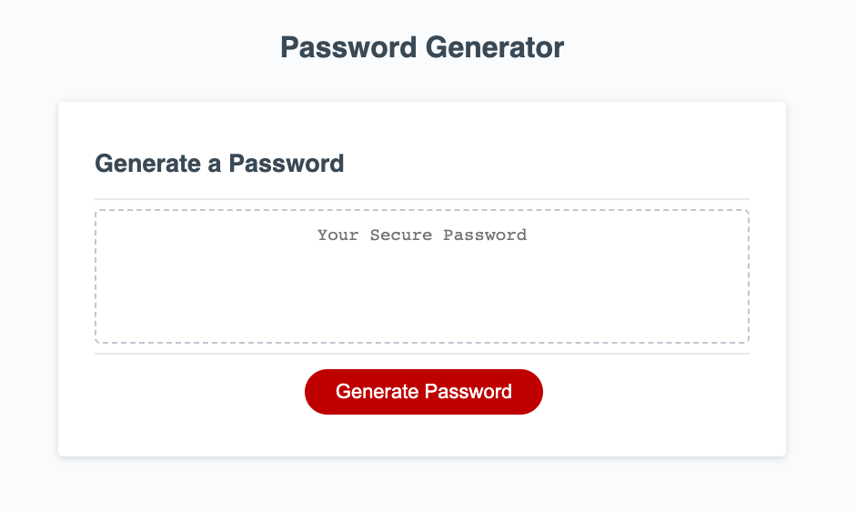

# password-generator

Description: This application uses javascript to generate a random and secure password. User will specify the password length and which characters to include, and then the application will randomly generate a secure password.

Installation: N/A

Usage: Please visit this link: https://clairebain3.github.io/password-generator/

Credits N/A

License Please refer to the license in the repo

